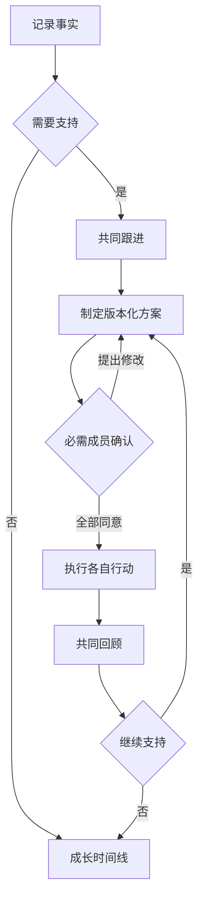
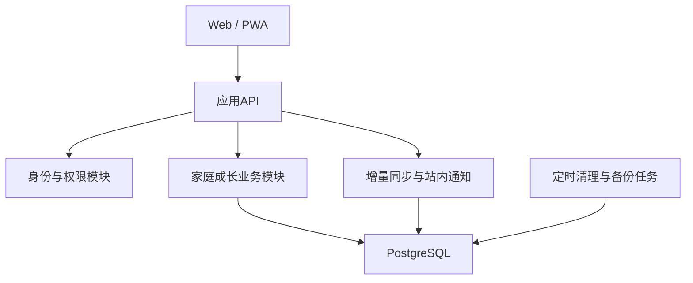

# 言午 · GrowTogether｜产品与技术设计文档

> 版本：v1.0｜日期：2026-09-14｜状态：开发设计基线，待目标环境验证
> 需求依据：言午_项目需求文档_PRD_v1.0.md
> 设计范围：交互、视觉、系统边界、数据、权限、接口、同步、验证与交付。
> 本文定义工程方案，不声称依赖版本、部署条件或性能目标已验证；实施时锁定依赖版本并核验官方文档。

## 1. 设计决策摘要

| 议题 | 决策 | 原因 |
|---|---|---|
| 交互形态 | 响应式Web + 可安装PWA壳 | 适配家庭碎片化协作 |
| 用户体系 | 成人独立账号，单家庭单孩子首版 | 真实协作，控制产品范围 |
| 导航 | 六个主页面，设置独立入口 | 对应查看、记录、学习、跟进、规划 |
| 业务架构 | 模块化单体API + 关系数据库 | 便于事务一致性与逐步扩展 |
| 同步 | 首版5秒增量轮询，写后主动刷新 | 容易实现撤权校验与稳定重连 |
| 并发 | 乐观锁version + 幂等键 | 防止家庭多人互相覆盖 |
| 权限 | 家庭成员校验 + 逐对象授权 | 健康、亲子记录控制可见范围 |
| 数值呈现 | 只对明确数值绘图，缺失保留 | 避免情绪打分和虚假趋势 |
| AI | 首版不接入，后续可选DeepSeek适配 | 核心业务不依赖模型调用 |

## 2. 页面与导航设计

| 路由 | 页面 | 核心组件 | 需求 |
|---|---|---|---|
| /login | 登录 | 登录表单、错误提示 | FR-01 |
| /onboarding | 创建/加入家庭 | 家庭信息、孩子基本资料 | FR-01/02 |
| / | 首页 | TodayList、PendingDecisions、FollowUpCards、Trends、ActivityFeed | FR-03 |
| /child | 孩子档案 | Profile、Interests、ChildVoice、SupportNotes | FR-02 |
| /records | 成长记录 | Filters、Timeline、RecordDetail | FR-04 |
| /learning | 学习安排 | TodayWeekSwitch、HomeworkList、HomeworkForm | FR-05 |
| /follow-ups | 共同跟进 | StatusTabs、FollowUpList | FR-06 |
| /follow-ups/:id | 跟进详情 | Facts、PlanVersions、Confirmations、Actions、Review | FR-06 |
| /goals | 成长方向 | DirectionCards、StageGoals、ActionList、Evidence | FR-07 |
| /settings/family | 家庭设置 | Members、Invites、Timezone | FR-01 |
| /settings/data | 数据与隐私 | Grants、Export、RecycleBin、DeleteFamily | FR-10 |

列表筛选进入URL参数，刷新与分享可保持筛选；对象详情链接始终重新鉴权。登录后只允许站内安全跳转。

### 2.1 首页布局

桌面采用左侧导航、顶部家庭栏、主区两栏（约2:1）。主栏为今日重点和共同跟进；侧栏为待确认与变化；家庭动态置底。手机采用单列：首页、记录、学习、跟进、更多五项底部入口；更多容纳档案与成长方向，逻辑上仍为六个主页面。

卡片必须包含明确动作，如“继续跟进”“确认方案”“查看作业”；不能仅展示孤立数量。首屏最多展示5项今日重点，其余折叠查看全部。无今日事项时提示“今天暂无待办”，提供记录入口，不制造完成压力。

### 2.2 快速记录

桌面侧栏宽约480px，手机全屏。必填事实与分类，时间默认当前；孩子表达和授权清楚可见，其他字段展开。保存时禁用重复点击，成功后返回时间线并定位新增记录。关闭未保存表单时询问保留当前页面编辑或放弃；首版不把敏感草稿长期写入本地存储。

开启“需要跟进”后出现负责人、回顾日期；通过一个事务同时创建记录与跟进。无授权成员可选时解释原因并保留输入。

### 2.3 跟进详情

从上到下：标题/状态/负责人/回顾时间 → 事实与孩子表达 → 当前方案及确认状态 → 成人与孩子行动分组 → 评论和历史 → 回顾。

“已读”“同意当前方案”“提出修改”三个动作有不同文案。方案编辑保存新版本后显示“方案已更新，请重新确认”。“结束本轮跟进”需填写结论；可选继续观察日期，不用“治愈”等结果词。

### 2.4 学习安排与成长方向

作业按今天/本周筛选，卡片显示截止、状态和支持方式；逾期徽标独立显示。进入待检查时突出指定检查人。目标详情同时展示孩子行动与家长支持，不将家长行动放入备注隐藏。

### 2.5 通用界面状态

| 状态 | 行为 |
|---|---|
| 首次空数据 | 简短解释 + 一个主要创建入口 |
| 加载 | 骨架屏，避免显示假数值 |
| 提交中 | 按钮加载，保留原内容 |
| 失败 | 显示可理解原因与重试，不清空输入 |
| 冲突 | 展示服务端最新版本与本人修改，允许重新编辑提交 |
| 无权限 | 不显示标题、正文、成员名单等对象信息 |
| 断网 | 顶部离线提示；提交失败后保留当前表单 |
| 数据不足 | 显示有效记录量，不画虚假趋势 |

## 3. 视觉与可访问性规范

风格：温和、清楚、可信，适合成人协作。主色深青绿#245B50，背景#F7F8F5，卡片#FFFFFF，正文#24332E，辅助文字#52635C，边框#DCE4DD，提示色#845B20。实际组件需检测对比度；浅色仅用于背景，不能用颜色单独表达状态。

字号：正文16px、辅助14px、页标题24–28px；行高1.5–1.7。间距采用4/8/12/16/24/32px；卡片圆角12px。手机触控区域至少44×44px。图标配文字；表单错误和标签关联，抽屉打开后管理焦点、关闭后归还焦点。

数值图使用折线/柱状图并提供文字摘要与数据表；缺失点断开。情绪和孩子表达用时间线。首版不做能力雷达图、综合分或儿童排名。人物信息用化名演示，不把用户家庭细节预置到生产。

## 4. 业务状态和闭环



### 4.1 状态机规则

| 对象 | 合法迁移 | 守卫条件 |
|---|---|---|
| 作业 | 未开始→进行中；进行中→待检查/已完成 | 需检查时不能直接完成 |
| 作业 | 待检查→已完成/进行中 | 指定检查人；退回必填原因 |
| 作业 | 已完成→进行中 | 授权编辑者，必填重开原因 |
| 跟进 | 待了解→行动中 | 当前方案达到确认条件 |
| 跟进 | 行动中→待回顾 | 主负责人主动提交回顾 |
| 跟进 | 待回顾→已结束/行动中 | 结束必填结论；新方案需重新确认 |
| 跟进 | 已结束→待了解 | 必填重开原因 |
| 方案 | 草稿→待确认→已确认 | 当前版本必需成员全部同意 |
| 方案 | 待确认→需修改 | 任一必需成员提出修改 |
| 行动 | 待开始→进行中→已完成 | 主负责人或授权监护人代操作，记录代理身份 |
| 行动 | 未完成→已取消 | 必填原因 |

任意关键方案变更新建版本，不覆盖旧版。已启动行动保留执行事实，但新版本未确认前不能显示全体达成新共识。逾期、外部支持、同步状态均不是业务主状态。

## 5. 系统结构

工程默认方案为TypeScript前端、Python API、PostgreSQL。前端可采用React生态的构建工具，API可采用FastAPI生态；本文不锁定具体版本与托管平台。选型依据是用户Python背景、清晰接口和关系事务需求，不代表对最新产品功能的核验。



模块分为identity、family、records、learning、followups、goals、actions、metrics、collaboration、data_management。业务逻辑集中在服务层，路由只负责解析/认证/响应，统计也经过相同权限过滤。首版不拆微服务、不引入向量库、消息队列或AI代理。

前后端建议同站部署，减少Cookie和跨域复杂度。身份适配标准身份提供方，服务端验证身份并映射User，使用安全会话Cookie；不在浏览器存储长期访问令牌。具体提供方在部署时决定，开发Mock登录只允许开发环境。

## 6. 数据模型

### 6.1 通用约定

ID使用UUID；时间戳UTC存储，家庭时区用于展示和日期归组；业务日期单独使用date。可编辑业务对象包含id、family_id、child_id、created_by、created_at、updated_by、updated_at、version、deleted_at。成员和家庭等实体按适用范围保留字段。

业务对象通过Resource统一管理授权：Resource(id, family_id, child_id, type, created_by, version, deleted_at)，具体表主键同时作为Resource外键。所有API禁止仅凭客户端family_id获得授权。

### 6.2 主要实体与字段

| 表 | 核心字段 | 约束与用途 |
|---|---|---|
| users | id, identity_subject, display_name | identity_subject唯一 |
| families | id, name, timezone, owner_user_id, status | 所有者须为有效成员 |
| family_members | id, family_id, user_id, role, status | family_id+user_id唯一 |
| invitations | id, family_id, token_hash, intended_identity, expires_at, used_at | 单次使用，存哈希 |
| children | resource_id, nickname, birth_date?, school_stage, grade? | 首版每家庭最多1个有效孩子 |
| child_sensitive_profiles | resource_id, child_id, health_note?, emergency_contact? | 独立Resource与授权 |
| child_interests | resource_id, child_id, title, observation, child_voice, observed_at | 保存阶段事实 |
| resources | id, family_id, child_id?, type, creator, version, deleted_at | 权限锚点 |
| resource_grants | resource_id, member_id, capability | read/comment/edit/manage；组合唯一 |
| growth_records | resource_id, category, occurred_at, fact, child_voice_status, child_quote?, observer_note?, parent_action? | quote与状态一致 |
| homework | resource_id, subject, content, due_at, status, support_mode, supporter_id?, check_required, checker_id?, completed_at? | 检查人需有效且可见 |
| homework_reviews | id, homework_id, reviewer_id, result, note, created_at | 保留退回/完成历史 |
| follow_ups | resource_id, source_record_id?, title, fact, child_quote?, owner_id, review_at, status, external_support | 来源删除后可置空，事实快照保留 |
| support_plans | id, follow_up_id, revision, content_json, required_member_ids, status | follow_up_id+revision唯一；已发布不可改 |
| plan_decisions | id, plan_id, member_id, decision, note, decided_at | plan_id+member_id唯一 |
| actions | resource_id, parent_resource_id?, plan_id?, title, actor_kind, owner_id, due_at, status, completed_at? | 一个成人记录负责人 |
| action_collaborators | action_id, member_id | 与家庭和授权一致 |
| development_goals | resource_id, parent_goal_id?, level, title, reason, child_agreement, support, review_at, status | 父子同家庭/孩子，层级不可循环 |
| reviews | id, resource_id, author_id, conclusion, evidence, next_review_at? | 继承父对象授权 |
| daily_metrics | resource_id, date, sleep_minutes?, exercise_minutes?, exercise_count?, reading_minutes?, source | child_id+date唯一；null与0不同 |
| comments | id, resource_id, author_id, body, version, edited_at?, deleted_at? | 权限完全继承 |
| read_receipts | resource_id, member_id, seen_version, read_at | 已读不等于确认 |
| activity_events | id, family_id, resource_id, actor_id, event_type, created_at | 只存最小动作信息 |
| notification_receipts | event_id, member_id, read_at? | 去重并再次鉴权 |
| idempotency_keys | actor_id, key, request_hash, response_ref, expires_at | actor+key唯一；默认24小时 |
| audit_logs | id, actor_id, resource_id?, operation, result, created_at | 不写敏感正文 |
| export_jobs | id, requester_id, family_id, status, scope, expires_at | 下载前重新验证权限 |

support_plans.content_json具有固定结构：objective、child_actions、parent_actions、support_method、review_at；通过服务端模式验证。发布时对应actions入库且绑定plan_id，更新方案创建新版本行动；旧行动事实保留并标记所属版本。

### 6.3 索引与完整性

为family_id+child_id+时间、作业due_at+status、跟进review_at+status、事件family_id+id建索引；软删除查询统一过滤。跨表使用包含family_id的复合外键或事务校验防止跨家庭引用。方案确认人、负责人和授权成员必须有效且属于同家庭。

删除普通关联对象不级联抹去独立跟进事实；删除整个家庭按完整依赖顺序清理。迁移必须版本化并含回滚/前滚说明，禁止以重新建库代替升级。

## 7. 授权设计

### 7.1 检查顺序

1. 验证会话与用户。
2. 查询有效家庭成员身份。
3. 校验对象family_id与child_id关系。
4. 查询具体对象授权及动作能力。
5. 校验业务守卫，如指定检查人、作者编辑权、当前方案版本。
6. 执行事务并写审计/活动事件。

权限交集生效：具有edit能力不代表可以绕过指定检查人；家庭所有者不自动获得受限健康正文。创建时将当前监护人展开为明确授权行，日后新成员不会因角色变化自动获得旧内容。

| 操作 | 所有者 | 监护人 | 照护者 |
|---|---|---|---|
| 管理家庭/邀请 | 是 | 否 | 否 |
| 阅读普通/受限内容 | 需对象授权 | 需对象授权 | 需对象授权 |
| 编辑成长事实 | 作者或明确授权 | 作者或明确授权 | 作者或明确授权 |
| 评论/完成任务 | 对象授权+业务规则 | 同左 | 同左 |
| 调整可见成员 | 对象manage | 对象manage | 默认无 |
| 整体删除家庭 | 是，二次确认 | 否 | 否 |

派生内容、评论、统计、动态、导出、搜索均受相同过滤。引用不可见对象不得泄漏标题；通知仅保存资源ID和动作类型，展示时即时取授权内容。移除成员后会话即便仍有效，也因成员校验失败无法访问。

## 8. API契约草案

统一前缀/api/v1；列表使用cursor和limit，默认20、最大100。成功返回data与meta；失败返回error.code/message/request_id，不能包含敏感堆栈。

| 方法/路径 | 功能 | 关键要求 |
|---|---|---|
| POST /families | 创建家庭 | 幂等，事务创建成员 |
| POST /families/:id/invitations | 创建邀请 | 所有者权限 |
| POST /invitations/accept | 接受邀请 | 验身份、时效、一次性 |
| DELETE /families/:id/members/:memberId | 移除成员 | 不能移除最后所有者 |
| GET /dashboard?date= | 首页聚合 | 逐对象过滤，时区 |
| GET/POST /records | 筛选/创建记录 | 输入验证、幂等 |
| PATCH /records/:id | 编辑记录 | If-Match版本 |
| POST /records/:id/follow-up | 转跟进 | 同事务、幂等、权限继承 |
| GET/POST /homework | 作业列表/创建 | 科目、截止校验 |
| POST /homework/:id/transitions | 更新状态 | 当前版本+守卫 |
| GET/POST /follow-ups | 列表/创建 | 负责人、复查必填 |
| POST /follow-ups/:id/plans | 发布方案版本 | expected_version；原子分配revision |
| POST /plans/:id/decisions | 同意/提出修改 | 仅当前版本必需成员 |
| POST /resources/:id/reviews | 写回顾 | 授权、结论 |
| GET/POST /goals | 列表/新增目标 | 层级与同家庭校验 |
| GET/POST /actions | 查询/创建行动 | 主负责人及来源校验 |
| PUT /metrics/:date | 保存当日数值 | 版本锁、唯一日期 |
| POST /resources/:id/comments | 评论 | 继承授权 |
| POST /resources/:id/read | 已读 | seen_version |
| PUT /resources/:id/grants | 调整授权 | manage，记录审计 |
| GET /changes?cursor= | 增量同步 | 返回授权变更ID，无正文泄露 |
| POST /exports | 发起导出 | 记录授权范围 |
| GET /exports/:id/download | 下载 | 再鉴权、短期可用 |
| DELETE /resources/:id | 软删除 | 版本+权限 |
| POST /resources/:id/restore | 恢复 | 30天内，重验授权 |

所有可变业务实体补齐详情、更新、删除路由遵循同一约定，不允许用通用更新接口绕过状态迁移。

写入示例：

```json
{
  "fact": "结束编程时，孩子说作品还没有保存。",
  "category": "parent_child_communication",
  "occurred_at": "2026-09-14T10:00:00+08:00",
  "child_voice_status": "expressed",
  "child_quote": "我还没保存。",
  "visible_member_ids": ["<有效成员ID>"],
  "version": 1
}
```

错误码：401未登录；403无动作权限；404不存在或对象不可见；409版本冲突/状态冲突；422字段错误；429频率限制。409仅在仍有阅读权时返回最新版本。

## 9. 并发、幂等与同步

写入使用UPDATE ... WHERE id=? AND version=?，成功后version+1；未更新返回409。业务变更、确认结果、行动创建、动态事件在同一数据库事务提交。

创建请求带Idempotency-Key，服务器记录请求摘要；同键同内容返回首次结果，同键不同内容拒绝。记录转跟进可额外约束来源记录与活动跟进关系，重试不能新增第二个对象。

前台每5秒请求增量变化，获得资源ID、版本、变更类型和下一游标；按需重新读取对象。页面回到前台立即刷新；后台降低频率。超出游标保留范围返回“需要全量刷新”。权限撤回触发客户端清除缓存；即使客户端未收到事件，服务端每次读取仍拒绝。敏感页面不长期持久化缓存。

方案确认事务锁定方案当前版本及确认集合，确认人数满足才置为confirmed；发布新版本时旧版本置superseded。移除必需确认成员使当前待确认方案失效，提示重新选择成员发布，不能默默降低确认人数。

## 10. 统计实现

家庭时区确定区间边界后转换为UTC查询。daily_metrics用本地date分组，睡眠归起床日，每天一个确认值。范围验证睡眠0–1440分钟，运动/阅读0–1440分钟，次数非负整数；范围仅用于防录入错误，不代表建议量。

作业完成率分母是期间截止且未删除/归档的作业，分子是其中当前已完成的作业；分母0显示“暂无作业”，不能显示0%或100%。未记录的数值返回null。缺失不插值；7日对比需两期各至少4个有效日期。所有计算限定当前用户可见对象，不能通过总量推断隐藏记录。

## 11. 安全、PWA与数据生命周期

- 会话Cookie设置HttpOnly、Secure与合适SameSite策略；写操作校验CSRF，服务端授权覆盖所有接口。
- 邀请令牌哈希存储，不写日志；登录与邀请接口限流，过期和使用后不可重放。
- 用户文本按纯文本渲染，CSV导出处理公式注入字符。禁止将个人正文传入分析埋点。
- PWA仅缓存版本化静态资源和离线提示页；业务API及敏感HTML不缓存。退出清除内存业务缓存和会话相关状态。
- 导出任务执行时及下载时均重新鉴权；权限变化则重建或终止文件，文件默认24小时后清理。
- 软删除30天，定时清除；备份最大保留30天。恢复备份后重放删除清单，防止已清理数据重新出现。
- 全站HTTPS、数据库最小权限账号、密钥通过运行环境提供；开发/测试/生产隔离。

后续附件使用私有对象存储与短期下载授权；后续AI仅在选择具体数据并明确授权后通过服务端适配DeepSeek，默认脱敏、保留生成来源并由家长确认入库。首版无需配置任何模型密钥。

## 12. 项目组织与开发任务

建议目录：apps/web（页面与组件）、apps/api（接口与服务）、packages/contracts（接口定义）、database/migrations（迁移）、tests（关键流程）、docs（两份文档与验收记录）。OpenAPI作为前后端契约来源，类型生成在构建时校验。

| 工作包 | 内容 | 交付与完成条件 |
|---|---|---|
| WP-01 | 工程脚手架与契约 | 可启动环境、环境变量示例、迁移运行 |
| WP-02 | 身份/家庭/授权 | 双账号家庭、跨家庭拒绝、撤权有效 |
| WP-03 | 记录与跟进 | 记录转跟进原子化、版本确认、行动回顾 |
| WP-04 | 作业与目标 | 检查守卫、目标层级、独立家长行动 |
| WP-05 | 首页/数值/同步 | 统计口径一致、两端更新、缺失说明 |
| WP-06 | 交付加固 | 导出删除、恢复演练、手机验收、部署说明 |

## 13. 验证方案

优先测试真实风险：

1. 权限集成测试：两个家庭、所有者/监护人/照护者、受限健康资料，覆盖详情、列表、统计、动态与导出。
2. 并发测试：两账号同版本编辑，验证一个成功一个409；两人同时确认与发布方案不产生错误共识。
3. 事务/幂等测试：重复转跟进、提交中断、失败重试，不能半保存或重复建单。
4. 状态测试：非检查人确认作业被拒绝；逾期与业务状态独立；新方案需重新确认。
5. 统计边界：空数据、明确0、缺失、跨午夜、跨时区、删除后分母变化。
6. 双浏览器端到端：爸爸记录 → 妈妈评论 → 两人确认 → 各自行动 → 回顾；再撤权并访问旧链接。
7. 手机验证：360px宽表单、抽屉焦点、错误后输入保留、断网提示、PWA启动。
8. 恢复演练：备份恢复到隔离环境，对照记录数和关联完整性，重放删除清单并检查授权。

验收记录逐项关联PRD AC-01至AC-14，记录环境、步骤、预期、实际和证据。测试失败先修复再交付，不用静态原型截图代替真实协作验证。

## 14. 部署、升级与运维设计

部署前确认域名、运行环境、身份服务、数据库、备份与时区；具体平台未绑定。先测试环境验证完整闭环，再上线正式环境。正式环境默认无演示内容，禁用开发身份绕过。

采用兼容迁移：先增加字段/表 → 部署兼容代码 → 回填并验证 → 后续版本移除旧字段。上线前备份，记录应用版本、迁移版本及恢复步骤；应用回滚不等于数据库自动回滚。

监控HTTP错误率、延迟、保存失败、同步落后、导出失败、备份成功时间和清理任务状态，不记录孩子正文。每日备份并校验可读取，定期恢复演练。RPO/RTO与性能目标以PRD为准，未演练前不得宣称达到。

## 15. 交给Codex的实施指令

> 阅读同目录PRD和设计文档，按WP-01至WP-06实施言午MVP。先检查现有仓库和运行条件，再形成可执行任务清单。保持六个主模块、成人独立账号、真实后端、逐对象权限、版本化确认和乐观锁。先完成记录到共同回顾闭环，再扩展作业、目标、首页与统计。不要用localStorage模拟多人数据库，不预置真实家庭资料，不新增AI、附件或孩子端。每个工作包完成后运行对应风险测试并记录证据；遇到环境缺失明确报告，不声称已部署。交付源代码、迁移、环境示例、启动与部署说明、验收记录和已知问题。

## 16. 后续设计决策登记

| 决策 | 当前状态 | 决定时点 |
|---|---|---|
| 身份提供方与登录渠道 | 待运行环境确定 | WP-01前 |
| 托管平台、数据库实例、备份位置 | 未绑定 | 部署前 |
| 首版是否需要PWA安装引导 | 默认包含基础引导 | 手机验收 |
| 更细的照护者编辑权限 | 默认逐对象授权 | 原型评审 |
| 孩子端、附件、AI | 明确后置 | 下一版本需求评审 |

本文是设计交付，不包含已完成的代码、线上链接或性能测试结果。
